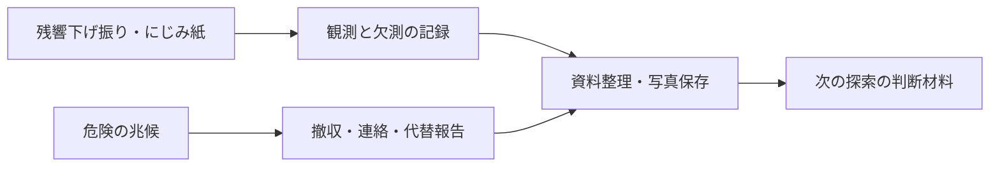
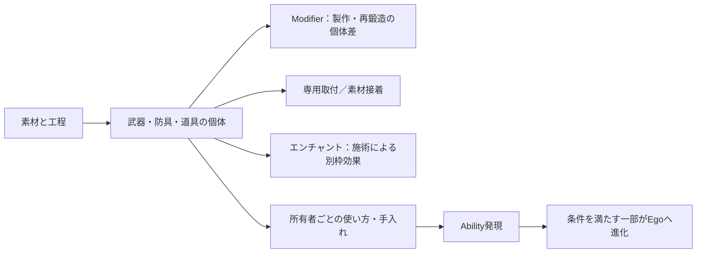
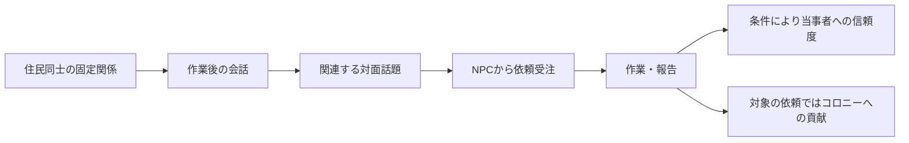

# 採用候補の相関図

図はゲーム内のつながりを示す設計案。シーン配線や実装済み機能は[N系ギミックの相関図](../../../systems.md)を参照。

観測・資料・次の遠征

```mermaid
flowchart LR
    Tools["残響下げ振り・にじみ紙"] --> Obs["観測と欠測の記録"]
    Obs --> Archive["資料整理・写真保存"]
    Archive --> Plan["次の探索の判断材料"]
    Danger["危険の兆候"] --> Retreat["撤収・連絡・代替報告"]
    Retreat --> Archive
```

製作・装着・使い込み

```mermaid
flowchart LR
    Material["素材と工程"] --> Item["武器・防具・道具の個体"]
    Item --> Modifier["Modifier：製作・再鍛造の個体差"]
    Item --> Attach["専用取付／素材接着"]
    Item --> Enchant["エンチャント：施術による別枠効果"]
    Item --> History["所有者ごとの使い方・手入れ"]
    History --> Ability["Ability発現"]
    Ability --> Ego["条件を満たす一部がEgoへ進化"]
```

住民の関係・依頼・貢献

```mermaid
flowchart LR
    Relation["住民同士の固定関係"] --> Talk["作業後の会話"]
    Talk --> Topic["関連する対面話題"]
    Topic --> Quest["NPCから依頼受注"]
    Quest --> Report["作業・報告"]
    Report --> Trust["条件により当事者への信頼度"]
    Report --> Colony["対象の依頼ではコロニーへの貢献"]
```

[採用候補の目次](README.md)
